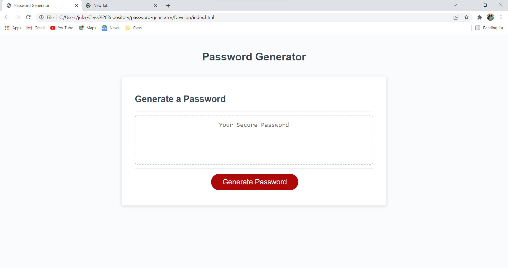

# password-generator

# <password-generator>

## Description

- Generating a tool to create a safe and secure password for the user.
- Adds additional layer of security by providing optional password criteria requirements.
- Gives the end-user the ability to create a simple or complex password.

## Table of Contents

- [Installation](#installation)
- [Usage](#usage)
- [Credits](#credits)
- [License](#license)

## Installation

This tool is embedded in a URL. No installation required. 

## Usage

Once the website is launched, navigate to the generate button then click once. A series of questions will processed to tailor the 
password to the users specifications. Code will generate automatically after questions are completed.

## Credits

Kyle Giuanta https://github.com/kgiunta

Isaak Morales https://github.com/CallMeIce

## License
Not Applicable

## Badges

